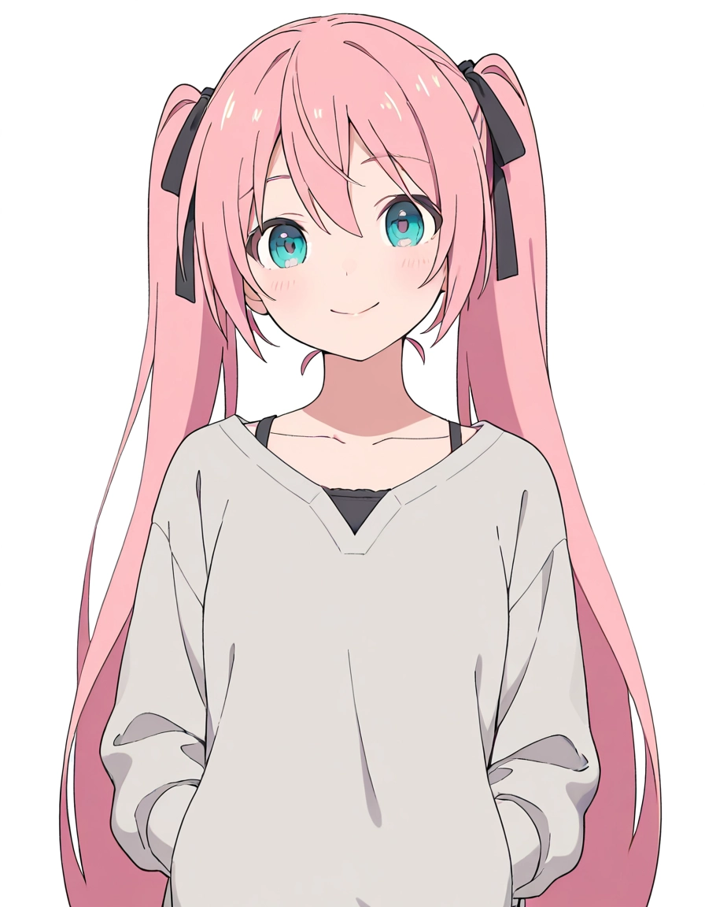

# SD Forge Negative Prompt in Prompt
This is an Extension for Forge [Classic](https://github.com/Haoming02/sd-webui-forge-classic/tree/classic) / [Neo](https://github.com/Haoming02/sd-webui-forge-classic/tree/neo), which implements **NegPip**, allowing you to give words a negative emphasis inside the positive prompt field to suppress a concept, or vice versa.

> [!IMPORTANT]
> Only **SD1** and **SDXL** are supported<br>
> 🔥 **New:** Now supports **Anima**

## How to Use

- add `(foo:-1.0)` in the `positive prompt` to **remove** a concept
- add `(bar:-1.0)` in the `negative prompt` to **enforce** a concept

## Examples

<table>
    <tr>
        <th>Base</th>
        <th><code>(aqua hair:-1.0)</code><br>in <b>Positive</b> Prompt</th>
        <th><code>(aqua hair:1.5)</code><br>in <b>Negative</b> Prompt</th>
    </tr>
    <tr>
        <td></td>
        <td></td>
        <td></td>
    </tr>
</table>

- **Full Prompts**

```
masterpiece, best quality, high quality, 1girl, solo, hatsune miku, vocaloid, casual, looking at viewer, smile, simple background, white background,
anime screenshot, anime coloring, screencap, flat color, masterpiece, best quality, very aesthetic, absurdres, aesthetic, detailed, beautiful color, amazing quality, highres, safe
Negative prompt: (signature), worst quality, bad quality, low quality, text, name, watermark, (hdr, cinematic, high contrast), logo, username, bad anatomy, bad proportions, extra limbs, extra digit, extra legs, extra legs and arms, disfigured, missing arms, too many fingers, fused fingers, missing fingers, unclear eyes, censored
```
